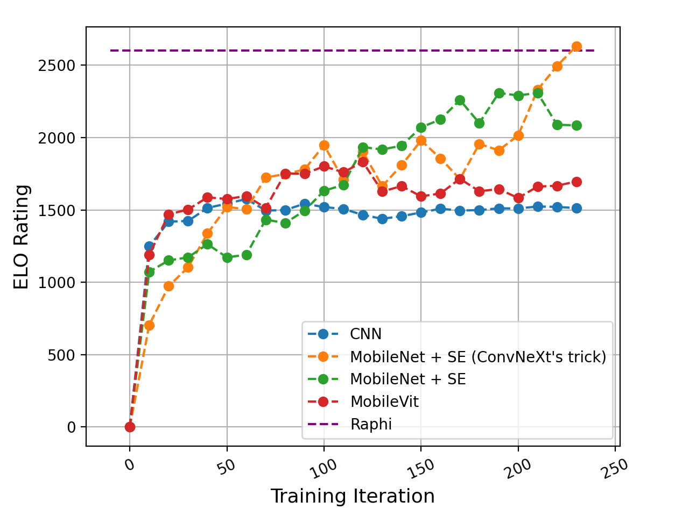
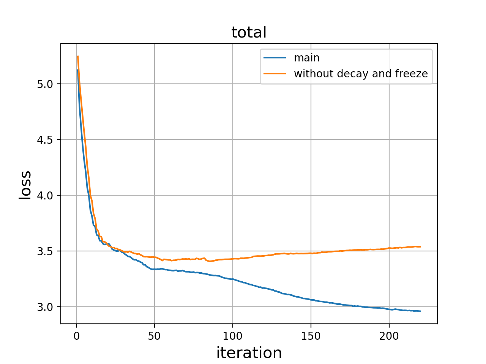
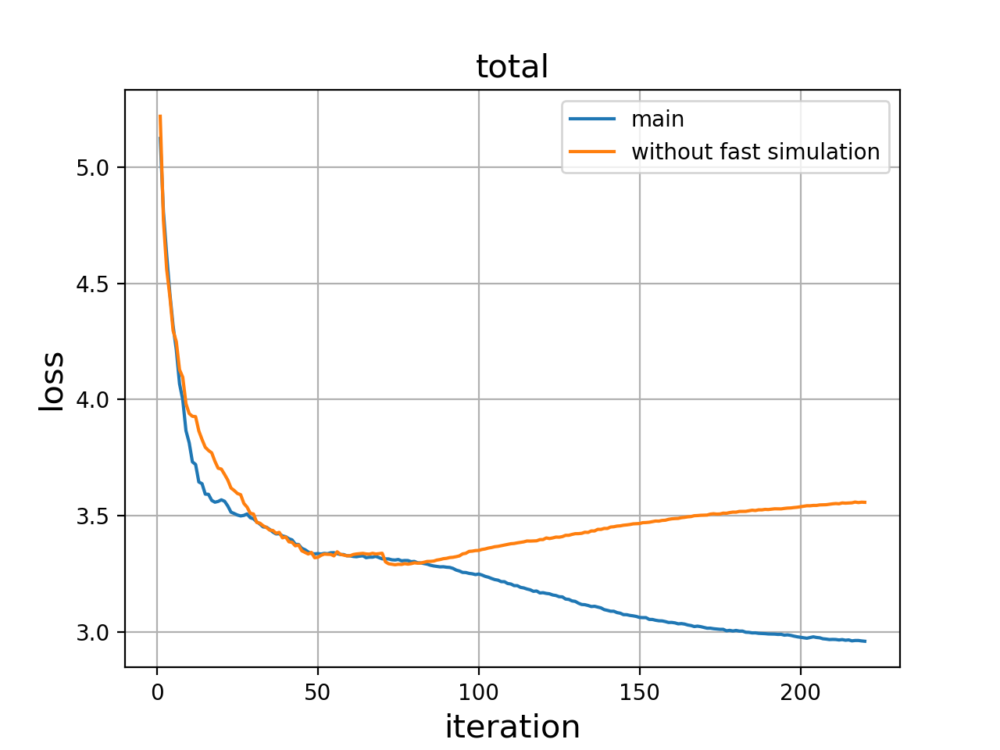
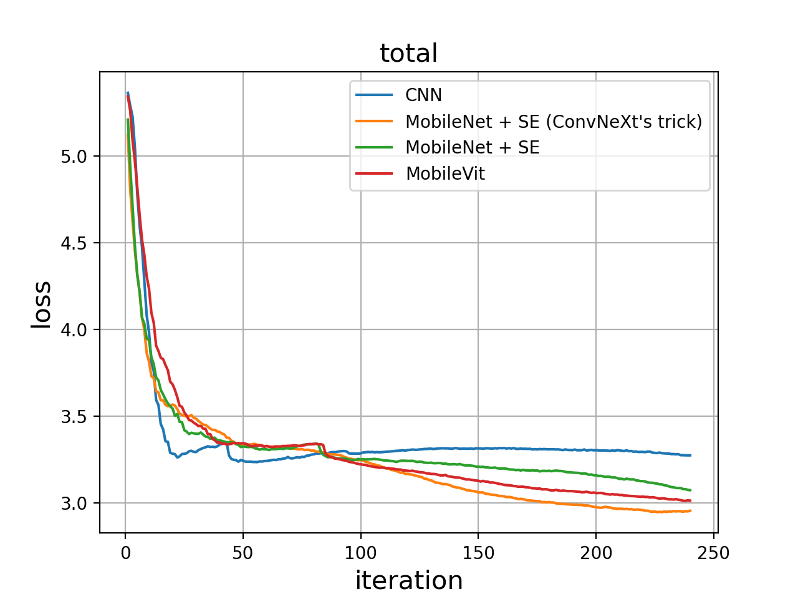

# UnderWorld_Boardgame-AI
> SJTU ACM Class Machine Learning 2021 Assignment ( CS420 Course Project )

A superhuman Board Game AI with the AlphaZero algorithm.

## Intro

- Achieved super-human performance in 13x13 Gomoku, 9x9 Go and 9x9 Othello.
- Train only via self-play with the fairly limited computational power of a single home PC.
- Accelerate training by reducing the upper limit of performance that the AI can achieve, but still be able to beat top human players.

## Feature
 - **Playout Cap Randomization**, which is a new technique introduced by KataGo that accelerates training.
 - **Temperature Decay**, which is a search technique that trades off randomness and quality of the play.
 - **Random Freeze**, which plays a important role in unbalanced games like Gomoku.
 - **MobileNet + SENet with ConvNeXt’s tricks**, which allows MCTS to do more playouts to achieve higher performance while ensuring a significantly fast training speed.
 - **Multi-threaded self-play agents**.
 - **MCTS implemented in C++, Neural Network implemented in Python, working together by pybind11**.
 

## Performance
On the 13x13 Gomoku board (swap 1 rule), after a week of training with RTX 3080, it reached the same level as Rapfi, which is one of the strongest alpha-beta Gomoku AI in the world.

